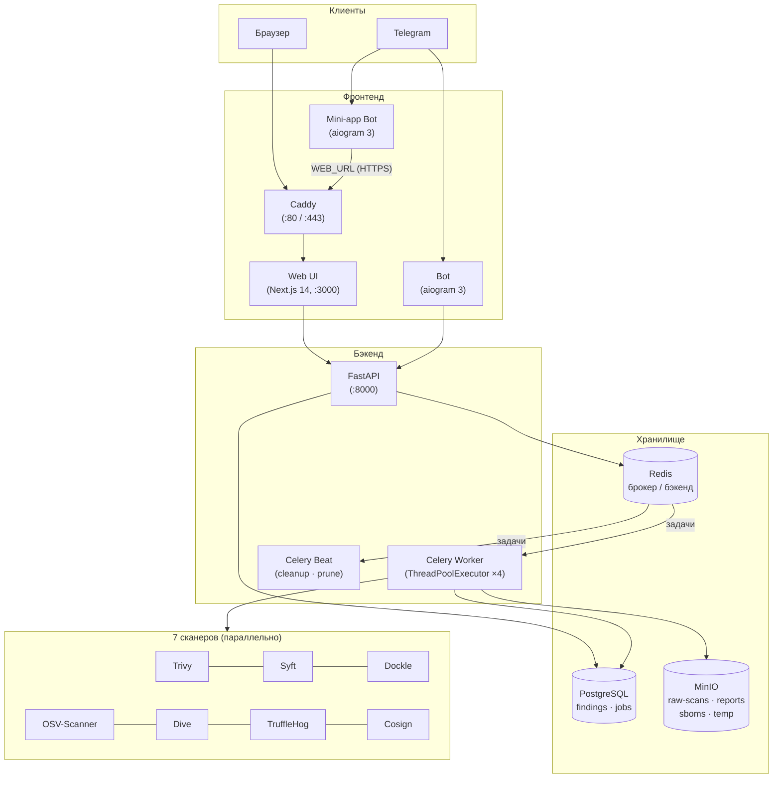

# MDMScan

> Автоматизированная система оценки безопасности Docker-образов

[](https://github.com/eror-ka/MDMScan/actions/workflows/ci.yml)
[](LICENSE)

MDMScan параллельно запускает **7 open-source сканеров**, нормализует и дедуплицирует
находки, вычисляет оценку безопасности (0–100) и отдаёт результаты через REST API,
веб-интерфейс и Telegram-бота.

---

## Содержание

- [Руководство пользователя](#руководство-пользователя)
- [Архитектура](#архитектура)
- [Сканеры](#сканеры)

---

## Руководство пользователя

### Требования

- Docker Engine ≥ 24 с доступом к `docker.sock`
- Docker Compose V2
- Токены двух Telegram-ботов ([@BotFather](https://t.me/BotFather)) — опционально

### Установка и запуск

```bash
git clone https://github.com/eror-ka/MDMScan.git
cd MDMScan

# Скопировать шаблон и заполнить CHANGE_ME-значения
cp .env.example .env

# Сгенерировать надёжные пароли
openssl rand -base64 24   # использовать для POSTGRES_PASSWORD и MINIO_ROOT_PASSWORD

# Запустить все сервисы
docker compose up -d
```

После запуска доступны:

| Сервис | Адрес |
|--------|-------|
| Веб-интерфейс | http://localhost (через Caddy) |
| REST API / Swagger | http://localhost:8000/docs |
| MinIO Console | http://localhost:9001 |

> Веб-интерфейс не проксируется на localhost по умолчанию — он доступен только через Caddy
> по домену из `WEB_URL`. Для локального доступа добавьте `localhost` в `Caddyfile` или
> обращайтесь напрямую к порту 3000 при разработке.

### Переменные окружения (`.env`)

| Переменная | Назначение | По умолчанию |
|------------|------------|--------------|
| `POSTGRES_PASSWORD` | Пароль PostgreSQL | `CHANGE_ME` |
| `MINIO_ROOT_PASSWORD` | Пароль MinIO | `CHANGE_ME` |
| `BOT_TOKEN` | Токен основного Telegram-бота | `CHANGE_ME` |
| `BOT_MINIAPP_TOKEN` | Токен мини-апп бота | `CHANGE_ME` |
| `WEB_URL` | Публичный HTTPS-URL для Telegram Mini App | — |
| `SCAN_RETENTION_DAYS` | Сколько дней хранить сканы | `5` |
| `SCAN_TIMEOUT_SECONDS` | Таймаут одного скана (секунды) | `1800` |

### Веб-интерфейс

1. Открыть главную страницу.
2. В поле ввода указать ссылку на образ, например `alpine:latest` или `nginx:1.25`.
3. Нажать **Запустить скан** — страница автоматически обновляется каждые 4 секунды.
4. После завершения отображается:
   - **Оценка безопасности** (0–100, цветовая индикация: ≥80 зелёный, 60–79 жёлтый, 40–59 оранжевый, <40 красный)
   - **Статус каждого из 7 сканеров** (ok / error)
   - **Таблица находок** по категориям: уязвимости, секреты, мисконфиги, гигиена, supply chain

Готовые результаты можно удалить кнопкой на главной странице — это очищает запись в БД (артефакты MinIO сохраняются до истечения `SCAN_RETENTION_DAYS`).

### Telegram-бот

Основной бот (`BOT_TOKEN`) — полнофункциональный интерфейс без браузера:

| Команда | Описание |
|---------|----------|
| `/start` | Главное меню с кнопками |
| `/scan [image]` | Запустить скан; если образ не указан — бот запросит его отдельным сообщением. Автоматически присылает отформатированный результат (опрашивает API каждые 5 с, макс. 6 мин) |
| `/status <id>` | Статус конкретного скана по UUID |
| `/list` | История сканов с постраничной навигацией |
| `/about` | Описание системы |
| `/help` | Справка по командам |

Мини-апп бот (`BOT_MINIAPP_TOKEN`) — открывает `WEB_URL` кнопкой прямо в Telegram (требует HTTPS).

### REST API

Интерактивная документация: `http://localhost:8000/docs`

| Метод | Путь | Описание |
|-------|------|----------|
| `GET` | `/health` | Проверка доступности |
| `GET` | `/scans` | Список сканов (`limit`, `offset`) |
| `POST` | `/scans` | Запустить новый скан `{"image_ref": "..."}` |
| `GET` | `/scans/{id}` | Статус, оценка, счётчики находок |
| `DELETE` | `/scans/{id}` | Удалить скан из БД |
| `GET` | `/scans/{id}/findings` | Находки (`severity`, `category`, `limit`, `offset`) |
| `POST` | `/auth/telegram` | Валидация Telegram Mini App `initData` |

### Мониторинг (опционально)

```bash
docker compose -f docker-compose.yml -f docker-compose.monitoring.yml up -d
```

| Сервис | Адрес |
|--------|-------|
| Grafana | http://localhost:3001 (admin / admin) |
| Prometheus | http://localhost:9091 |

Datasources Prometheus и Loki настроены через provisioning автоматически.

**Доступные метрики:**
- `mdmscan_scans_total{status}` — счётчик завершённых сканов
- `mdmscan_findings_total{category,severity}` — находки по категориям и severity
- `mdmscan_scanner_duration_seconds{scanner,status}` — время работы каждого сканера
- `mdmscan_scan_duration_seconds{status}` — полное время скана
- `http_request_duration_seconds`, `http_requests_total` — HTTP-метрики FastAPI

### Периодические задачи (Celery Beat)

| Задача | Расписание | Описание |
|--------|------------|----------|
| `cleanup_orphan_temp` | Каждый час (:00) | Удаляет временные рабочие директории, помечает зависшие сканы `failed` |
| `cleanup_old_scans` | Ежедневно 03:00 UTC | Удаляет из БД сканы старше `SCAN_RETENTION_DAYS` (каскадно — находки и артефакты) |
| `prune_docker_images` | Каждый час (:30) | `docker image prune -f` для освобождения дискового пространства |

MinIO дополнительно применяет lifecycle-политику с тем же сроком — артефакты удаляются автоматически даже без Celery.

### Пересборка после изменений

```bash
docker compose up -d --build worker   # после изменений в worker/parsers
docker compose up -d --build api      # после изменений в API
docker compose up -d --build web      # после изменений в веб-интерфейсе
docker compose up -d --build bot miniapp-bot

# Проверить, что все 7 сканеров установлены и работают
docker compose exec worker verify-tools

# Запустить скан вручную (полезно для отладки)
docker compose exec worker celery -A app.tasks call mdmscan.scan_image --args '["alpine:latest"]'

# Логи в реальном времени
docker compose logs -f worker beat api
```

---

## Архитектура



### Сервисы

| Сервис | Стек | Хост-порт |
|--------|------|-----------|
| **API** | FastAPI + SQLAlchemy 2, Uvicorn | `127.0.0.1:8000` |
| **Worker** | Celery + Python 3.12, 7 сканеров | — |
| **Beat** | Celery Beat + Prometheus | `127.0.0.1:9092` → `:9090` |
| **Web** | Next.js 14 (App Router), TypeScript, Tailwind | через Caddy |
| **Bot** | aiogram 3, aiohttp | — |
| **Mini-app bot** | aiogram 3 | — |
| **PostgreSQL** | postgres:latest | `127.0.0.1:5432` |
| **Redis** | redis:latest (AOF) | `127.0.0.1:6379` |
| **MinIO** | minio/minio | `127.0.0.1:9000`, `9001` |
| **Caddy** | caddy:alpine, авто-HTTPS | `:80`, `:443` |

### Поток данных скана

```
POST /scans → ScanJob(pending) → Celery task
  └─ docker pull <image>
  └─ 7 сканеров параллельно (ThreadPoolExecutor, max 4)
       └─ артефакты → MinIO raw-scans
       └─ парсинг → Finding[] → дедупликация по SHA1-fingerprint
       └─ bulk-insert в PostgreSQL
  └─ _compute_security_score()
  └─ ScanJob(done) + manifest.json → MinIO
```

**Дедупликация:** каждая находка идентифицируется SHA1-отпечатком
`category|raw_ref|package|version|location`. При совпадении сохраняется максимальный
severity и объединяются источники.

### Оценка безопасности (0–100)

База — 100 баллов, вычитаются штрафы по категориям:

| Категория | Логика | Макс. штраф |
|-----------|--------|-------------|
| **Уязвимости** | Тиерная (worst tier wins): ≥2 CRITICAL → −75; 1 CRITICAL → −50; ≥5 HIGH → −15; 1–4 HIGH → −10 | −75 |
| **Мисконфиги** | Тиерная: ≥2 CRITICAL → −15; 1 CRITICAL → −10; ≥1 HIGH → −2.5 | −15 |
| **Секреты** | −1 за каждую находку (без ограничения сверху) | без лимита |
| **Гигиена** | Тиерная: efficiency <50% → −10; efficiency <75% → −5 | −10 |

Итог: `max(0, round(100 − сумма штрафов))`.

---

## Сканеры

MDMScan использует 7 специализированных open-source инструментов, покрывающих различные
аспекты безопасности Docker-образа:

| Сканер | Категория | Что проверяет | Severity |
|--------|-----------|---------------|----------|
| [**Trivy**](https://github.com/aquasecurity/trivy) | `vuln` · `misconfig` · `secret` | CVE в OS и language-пакетах, Dockerfile-мисконфиги (CIS), секреты в слоях | CRITICAL / HIGH / MEDIUM / LOW / UNKNOWN |
| [**Syft**](https://github.com/anchore/syft) | `supply_chain` | Генерирует SBOM (SPDX-JSON): полный список компонентов и лицензий | INFO |
| [**Dockle**](https://github.com/goodwithtech/dockle) | `misconfig` | CIS Docker Benchmark v1.6 (права на файлы, USER, HEALTHCHECK и пр.) | HIGH / MEDIUM / INFO |
| [**OSV-Scanner**](https://github.com/google/osv-scanner) | `vuln` | Уязвимости из базы OSV (Google) по SBOM/lock-файлам; severity по CVSS | CRITICAL / HIGH / MEDIUM / LOW / INFO |
| [**Dive**](https://github.com/wagoodman/dive) | `hygiene` | Эффективность слоёв образа, ненужные файлы, wasted bytes | CRITICAL (<50%) / HIGH (<75%) / MEDIUM (<85%) / LOW (<95%) / INFO |
| [**TruffleHog**](https://github.com/trufflesecurity/trufflehog) | `secret` | Утечки секретов, токенов и ключей в файловой системе образа | HIGH (верифицировано) / MEDIUM (не верифицировано) |
| [**Cosign**](https://github.com/sigstore/cosign) | `supply_chain` | Наличие криптографической подписи и attestations образа | INFO |

### Сравнение подходов

| Аспект | Trivy | OSV-Scanner | TruffleHog | Dockle | Dive | Syft | Cosign |
|--------|-------|-------------|------------|--------|------|------|--------|
| **Источник уязвимостей** | NVD, GitHub Advisory, OS advisories | Google OSV | — | — | — | — | — |
| **Анализ секретов** | Базовый (regex) | — | Глубокий (600+ детекторов, верификация) | — | — | — | — |
| **SBOM** | Частичный | Принимает на вход | — | — | — | SPDX / CycloneDX | — |
| **Конфигурации** | Dockerfile-lint | — | — | CIS Benchmark | — | — | — |
| **Слои образа** | — | — | — | — | Визуальный анализ | — | — |
| **Подпись** | — | — | — | — | — | — | Sigstore/Cosign |
| **Вывод** | JSON | JSON | NDJSON | JSON | JSON | SPDX-JSON | Text |

**Trivy vs OSV-Scanner** — оба ищут CVE, но из разных баз данных: Trivy использует
собственную базу (NVD + дистрибутивные advisory), OSV-Scanner — базу [OSV](https://osv.dev),
которая агрегирует данные из GitHub Advisory, PyPA, RustSec и др. Совместный запуск
увеличивает полноту покрытия.

**Trivy vs TruffleHog** — Trivy ищет секреты простыми регулярными выражениями;
TruffleHog применяет 600+ специализированных детекторов и, где возможно, верифицирует
находку реальным API-запросом (confirmed leak vs potential leak).

---

## Документация

- [REST API](docs/api.md) — полный справочник эндпоинтов
- [Формат отчёта](docs/report-format.md) — структура артефактов MinIO и `manifest.json`
- [Добавить сканер](docs/add-scanner.md) — пошаговое руководство

---

## Лицензия

MIT
