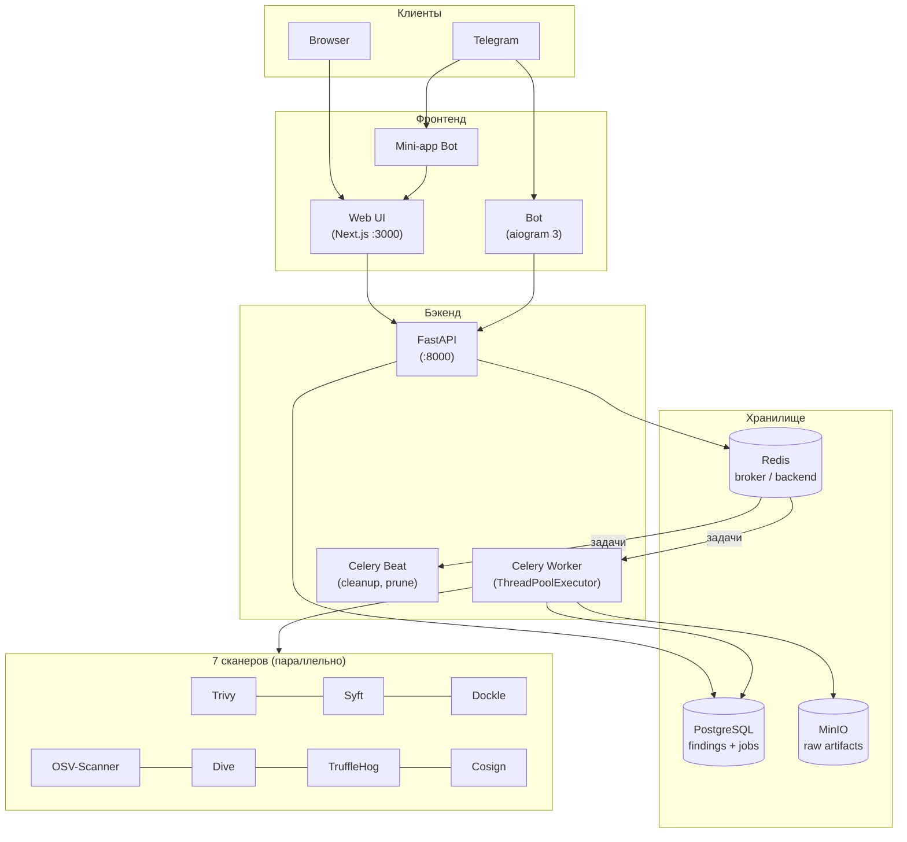

# MDMScan

> Автоматизированная система оценки безопасности Docker-образов

[](https://github.com/eror-ka/MDMScan/actions/workflows/ci.yml)
[](LICENSE)

MDMScan параллельно запускает 7 open-source сканеров, нормализует и дедуплицирует
находки, вычисляет оценку безопасности (0–100), хранит результаты в PostgreSQL + MinIO
и отдаёт их через REST API, веб-интерфейс и Telegram-бота.

<!-- Запись экрана веб-интерфейса во время скана (заменить на реальный GIF) -->
<!--  -->

---

## Быстрый старт

```bash
git clone https://github.com/eror-ka/MDMScan.git
cd MDMScan
cp .env.example .env          # заполнить CHANGE_ME
docker compose up -d
```

| Сервис | Адрес |
|--------|-------|
| Веб-интерфейс | http://localhost:3000 |
| REST API / Swagger | http://localhost:8000/docs |
| MinIO Console | http://localhost:9001 |

> Пароли: `openssl rand -base64 24`.  
> Токены Telegram-ботов: [@BotFather](https://t.me/BotFather).

---

## Архитектура



---

## Сканеры

| Сканер | Категория | Что проверяет |
|--------|-----------|---------------|
| [Trivy](https://github.com/aquasecurity/trivy) | `vuln`, `misconfig`, `secret` | CVE в пакетах, Dockerfile-мисконфиги, секреты |
| [Syft](https://github.com/anchore/syft) | `hygiene` | SBOM (Software Bill of Materials) |
| [Dockle](https://github.com/goodwithtech/dockle) | `misconfig` | CIS Docker Benchmark |
| [OSV-Scanner](https://github.com/google/osv-scanner) | `vuln` | Уязвимости из базы OSV |
| [Dive](https://github.com/wagoodman/dive) | `hygiene` | Эффективность слоёв, ненужные файлы |
| [TruffleHog](https://github.com/trufflesecurity/trufflehog) | `secret` | Утечки секретов и credentials |
| [Cosign](https://github.com/sigstore/cosign) | `supply_chain` | Подписи и attestations образа |

---

## Оценка безопасности (0–100)

| Категория | Макс. штраф | Логика |
|-----------|-------------|--------|
| Уязвимости | −65 | Тиерная: `CRITICAL >1` → −65, `CRITICAL 1` → −50, `HIGH ≥5` → −10 |
| Мисконфиги | −20 | Аддитивная по severity |
| Секреты | −10 | Пропорционально «плохости» |
| Гигиена | −5 | Пропорционально «плохости» |

При отсутствии CRITICAL-уязвимостей итоговая оценка не опускается ниже 75.

---

## Конфигурация (`.env`)

| Переменная | Назначение | По умолчанию |
|------------|-----------|--------------|
| `POSTGRES_USER/PASSWORD/DB` | Реквизиты PostgreSQL | — |
| `MINIO_ROOT_USER/PASSWORD` | Реквизиты MinIO | — |
| `BOT_TOKEN` | Токен основного Telegram-бота | — |
| `BOT_MINIAPP_TOKEN` | Токен мини-апп бота | — |
| `WEB_URL` | Публичный URL веб-интерфейса | `http://localhost:3000` |
| `SCAN_RETENTION_DAYS` | Сколько дней хранить сканы | `5` |
| `SCAN_TIMEOUT_SECONDS` | Таймаут одного скана | `1800` |

---

## Периодические задачи (Celery Beat)

| Задача | Расписание | Описание |
|--------|-----------|----------|
| `cleanup_orphan_temp` | каждый час | Удаляет зависшие рабочие директории, помечает зависшие сканы `failed` |
| `cleanup_old_scans` | ежедневно 03:00 UTC | Удаляет сканы старше `SCAN_RETENTION_DAYS` из БД + MinIO |
| `prune_docker_images` | каждый час | `docker image prune -f` |

MinIO дополнительно применяет lifecycle policy (ILM) с тем же сроком хранения — файлы удаляются автоматически даже без Celery.

---

## Мониторинг (опционально)

```bash
docker compose -f docker-compose.yml -f docker-compose.monitoring.yml up -d
```

| Сервис | Адрес |
|--------|-------|
| Grafana | http://localhost:3001 (admin / admin) |
| Prometheus | http://localhost:9091 |

Datasources Prometheus и Loki преднастроены через provisioning.

**Prometheus-метрики:**
- `mdmscan_scans_total{status}` — счётчик сканов
- `mdmscan_findings_total{category,severity}` — находки
- `mdmscan_scanner_duration_seconds{scanner,status}` — тайминги каждого сканера
- `mdmscan_scan_duration_seconds{status}` — полное время скана
- `http_requests_total`, `http_request_duration_seconds` — HTTP-метрики FastAPI

---

## Telegram-боты

**Основной бот** (`BOT_TOKEN`):
- `/scan [image]` — запустить скан, дождаться результата, получить отчёт
- `/status <id>`, `/list`, `/help`, `/about`

**Мини-апп бот** (`BOT_MINIAPP_TOKEN`) — открывает `WEB_URL` кнопкой.

---

## Документация

- [REST API](docs/api.md)
- [Формат отчёта](docs/report-format.md)
- [Добавить сканер](docs/add-scanner.md)

Интерактивная документация: `http://localhost:8000/docs`

---

## Разработка

```bash
pre-commit install
pre-commit run --all-files    # ruff check + ruff format

# Запустить скан вручную
docker compose exec worker celery -A app.tasks call mdmscan.scan_image --args '["alpine:latest"]'

# Пересобрать сервис после изменений
docker compose up -d --build worker

# Логи
docker compose logs -f worker beat api
```

---

## Лицензия

MIT
